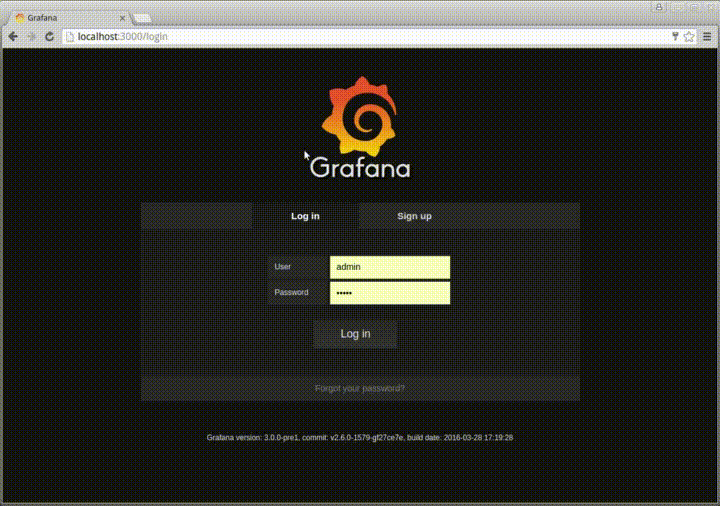
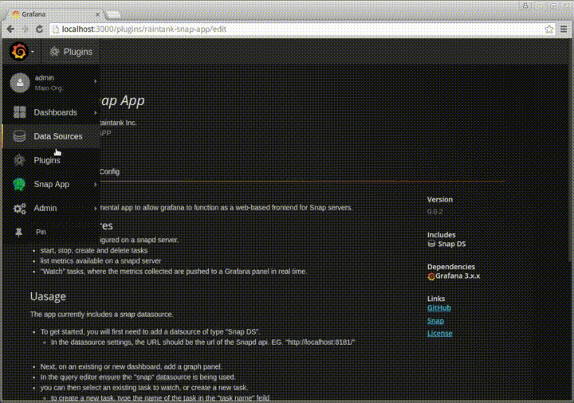
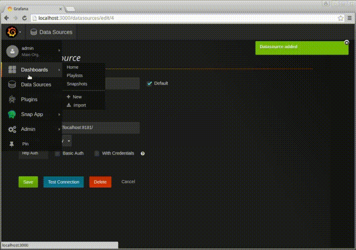

# Explore Snap

In this section we will:

* manage snap plugins
* determine available telemetry metrics
* create and observe task
* visualize telemetry data in Grafana

NOTE: The Snap exercises in this lab can be performed by logging into the snap container. This section assumes any commands are executed within the snap container:
```
$ docker-compose  exec snap /bin/bash
root@ab2b16b4ccc9:/#
```

## Overview

snap commands:
* snapd: snap service daemon
* snapctl: snap command line tool

## `snapctl` command

snapctl contains several sub-commands:

```
$ snapctl
NAME:
   snapctl - The open telemetry framework

USAGE:
   snapctl [global options] command [command options] [arguments...]

VERSION:
   v0.15.0-beta

COMMANDS:
     agreement	Can only be used when tribe mode is enabled.
     member	Can only be used when tribe mode is enabled.
     metric
     plugin
     task
```

list available plugins (see [Plugin Catalog](http://snap-telemetry.io/plugins.html) for current list and plugins in development).
```
$ cd /tmp/plugins/snap-v0.15.0-beta/plugin
$ ls
snap-plugin-collector-apache         snap-plugin-collector-nova
snap-plugin-collector-ceph           snap-plugin-collector-openfoam
snap-plugin-collector-cinder         snap-plugin-collector-osv 
...
```

load snap psutil plugin:
```
$ snapctl plugin load snap-plugin-collector-psutil
Plugin loaded
Name: psutil
Version: 6
Type: collector
Signed: false
Loaded Time: Thu, 21 Jul 2016 11:29:21 PDT
```

list metrics exposed by plugins:
```
$ snapctl metric list | less
NAMESPACE                         VERSION
/intel/psutil/cpu0/guest          6
/intel/psutil/cpu0/guest_nice     6
/intel/psutil/cpu0/idle           6
/intel/psutil/cpu0/iowait         6
/intel/psutil/cpu0/irq            6
/intel/psutil/cpu0/nice           6
```

list loaded plugins:
```
$ snapctl plugin list
NAME   VERSION   TYPE      SIGNED    STATUS    LOADED TIME
psutil   6     collector   false     loaded    Wed, 24 Aug 2016 17:33:52 UTC
```

unload plugin requires the plugin version (because snap supports multiple versions of the same plugin):
```
$ snapctl plugin unload collector:psutil:6
Plugin unloaded
Name: psutil
Version: 6
Type: collector
```

### Exercise

Extract snap plugins, and use snapctl command to:
* load `snap-plugin-collector-meminfo` plugin
* list meminfo metrics (hint: `... | grep meminfo`)
* unload `snap-plugin-collector-meminfo` (hint: use `snapctl plugin list` to get necessary info)
* load `snap-plugin-publisher-file` plugin

## snap REST API

snapctl is retrieving data from snapd REST API:
```
$ curl -L localhost:8181/v1/metrics
{
  "meta": {
    "code": 200,
    "message": "Metric",
    "type": "metrics_returned",
    "version": 1
  },
  "body": []
}
```

```
$ curl -L localhost:8181/v1/plugins
{
  "meta": {
    "code": 200,
    "message": "Plugin list returned",
    "type": "plugin_list_returned",
    "version": 1
  },
  "body": {}
}
```

```
$ curl -L localhost:8181/v1/tasks
{
  "meta": {
    "code": 200,
    "message": "Scheduled tasks retrieved",
    "type": "scheduled_task_list_returned",
    "version": 1
  },
  "body": {
    "ScheduledTasks": []
  }
}
```

### Exercise

Use curl and REST API to:
* list all available metrics in REST (hint: `curl ... | jq`)
* list a single metric in REST
* what does /intel/psutil/vm/inactive metrics collect? (for more info see [metrics 2.0](http://metrics20.org/))

## Running telemetry tasks

snap package includes several example tasks:
```
$ tree /opt/snap/examples/tasks
/opt/snap/examples/tasks
`-- iostat.yaml
```

review an example task:
```
$ cat /opt/snap/examples/tasks/iostat.yaml
---
  version: 1
  schedule:
    type: "simple"
    interval: "1s"
  max-failures: 10
  workflow:
    collect:
      metrics:
        /intel/psutil/load/load1: {}
        /intel/psutil/load/load15: {}
        /intel/psutil/load/load5: {}
      publish:
        - plugin_name: "file"
          config:
            file: "/tmp/snap_published_demo_file.log"
```

create task from config file:
```
$ snapctl task create -t /opt/snap/examples/tasks/iostat.yaml
Using task manifest to create task
Task created
ID: 8f3f3994-6341-49e3-bd96-10ec364e3263
Name: Task-8f3f3994-6341-49e3-bd96-10ec364e3263
State: Running
```

list all tasks:
```
$ snapctl task list
ID                                        NAME                                           STATE        HIT     MISS   FAIL   CREATED              LAST FAILURE
8f3f3994-6341-49e3-bd96-10ec364e3263      Task-8f3f3994-6341-49e3-bd96-10ec364e3263      Running      16      0      0      11:41AM 7-21-2016
```

watch running tasks:
```
$ snapctl task watch 8f3f3994-6341-49e3-bd96-10ec364e3263
Watching Task (8f3f3994-6341-49e3-bd96-10ec364e3263):
NAMESPACE                              DATA       TIMESTAMP
/intel/linux/iostat/avg-cpu/%idle      99.49      2016-08-24 18:23:55.208406929 +0000 UTC
/intel/linux/iostat/avg-cpu/%system    0.51       2016-08-24 18:23:55.208413522 +0000 UTC
/intel/linux/iostat/avg-cpu/%user      0          2016-08-24 18:23:55.208418416 +0000 UTC
```

see output in file:
```
$ tail -f /tmp/cpu_stat.log
[{"namespace":[{"Value":"intel","Description":"","Name":""},{"Value":"linux","Description":"","Name":""},{"Value":"iostat","Description":"","Name":""},{"Value":"avg-cpu","Description":"","Name":""},{"Value":"%idle","Description":"","Name":""}],"last_advertised_time":"0001-01-01T00:00:00Z","version":0,"config":null,"data":99.5,"tags":{"plugin_running_on":"4f8b31013a70"},"Unit_":"","description":"","timestamp":"2016-08-24T18:25:13.349462826Z"},{"namespace":[{"Value":"intel","Description":"","Name":""},{"Value":"linux","Description":"","Name":""},{"Value":"iostat","Description":"","Name":""},{"Value":"avg-cpu","Description":"","Name":""},{"Value":"%system","Description":"","Name":""}],"last_advertised_time":"0001-01-01T00:00:00Z","version":0,"config":null,"data":0,"tags":{"plugin_running_on":"4f8b31013a70"},"Unit_":"","description":"","timestamp":"2016-08-24T18:25:13.34946832Z"},{"namespace":[{"Value":"intel","Description":"","Name":""},{"Value":"linux","Description":"","Name":""},{"Value":"iostat","Description":"","Name":""},{"Value":"avg-cpu","Description":"","Name":""},{"Value":"%user","Description":"","Name":""}],"last_advertised_time":"0001-01-01T00:00:00Z","version":0,"config":null,"data":0.5,"tags":{"plugin_running_on":"4f8b31013a70"},"Unit_":"","description":"","timestamp":"2016-08-24T18:25:13.349471916Z"}]
```

stop task:
```
$ snapctl task stop 8f3f3994-6341-49e3-bd96-10ec364e3263
Task stopped:
ID: 8f3f3994-6341-49e3-bd96-10ec364e3263
```

### Exercise

* ensure the following plugins are load
    * `snap-plugin-collector-iostat`
    * `snap-plugin-publisher-file`
* create a task using the example `/opt/snap/examples/tasks/iostat.yaml`
* verify the task is running successfully (`tail -1 /tmp/cpu_stat.log | jq`)
* stop the psutil task `snapctl task stop ...`

## Writing tasks

snap task processes telemetry data correspond with the three types of plugins availble:
* collectors
* processors
* publishers

### task scheduling

snap schedule supports:
* simple (run forever on given interval)
* window (repeat interval between start/stop time)
* cron (use cron syntax for interval)

cron schedule example:
```
---
  version: 1
  schedule: {
      type: cron
      interval: "0 30 * * * *"
  },
```

### task metrics

snap collect metrics can be a concrete namespace, a wildcard `*`, or a tuple `(a|b)`.

As an example the mock plugin with the metrics:
* /intel/mock/foo/ex1
* /intel/mock/foo/ex2
* /intel/mock/bar/ex1
* /intel/mock/bar/ex2


| metrics in task manifest | collected metrics |
| ------------------------ | ----------------- |
| /intel/mock/\* | /intel/mock/foo/ex1 </br> /intel/mock/foo/ex2 </br> /intel/mock/bar/ex1 </br> /intel/mock/bar/ex2 |
| /intel/mock/foo/(ex1/ex2) | /intel/mock/foo/ex1 </br> /intel/mock/foo/ex2|
| /intel/mock/\*/ex1) | /intel/mock/foo/ex1 </br> /intel/mock/bar/ex1 |

### Exercise

* gather all smart disk statistics. (use: `snap-plugin-collector-smart`)
* write metrics to /var/log/disk_statistics.log
* schedule the task to run every minute
* wait and verify the task ran successfully

## Grafana

Grafana provides real time visualization of telemetry data gathered by snap.

* login to Grafana at [http://localhost:3000](http://localhost:3000) (user: admin password: admin)
* navigate to the [app config page](http://localhost:3000/plugins/raintank-snap-app/edit) and enable snap app:
    

* click on the Grafana logo and [select data sources](http://localhost:3000/datasources)
    
    create a [new data source](http://localhost:3000/datasources/new) use the following settings:

    ```
Name: "snap"
Default: true (checkbox)
Type: Snap DS
URL: http://snap:8181
Access: proxy
    ```
* create a [new dashboard](http://localhost:3000/dashboard/new)
    
    * add a graph panel: (insert screenshot)
    * select 'snap' as Panel datasource: (insert screenshot)
    * create the following task:
    ```
Task Name: memory active
Interval: 200ms
Metrics: /intel/linux/iostat/avg-cpu/%idle
    ```
* click on watch and observe the metrics stream in

### Exercise

* login to grafana and create the snap datasource
* create a new dashboard and monitor cpu metrics (%idle, %user, %system)
* to generate cpu load run `dd if=/dev/urandom | bzip2 -9 > /dev/null` in the snap container.
